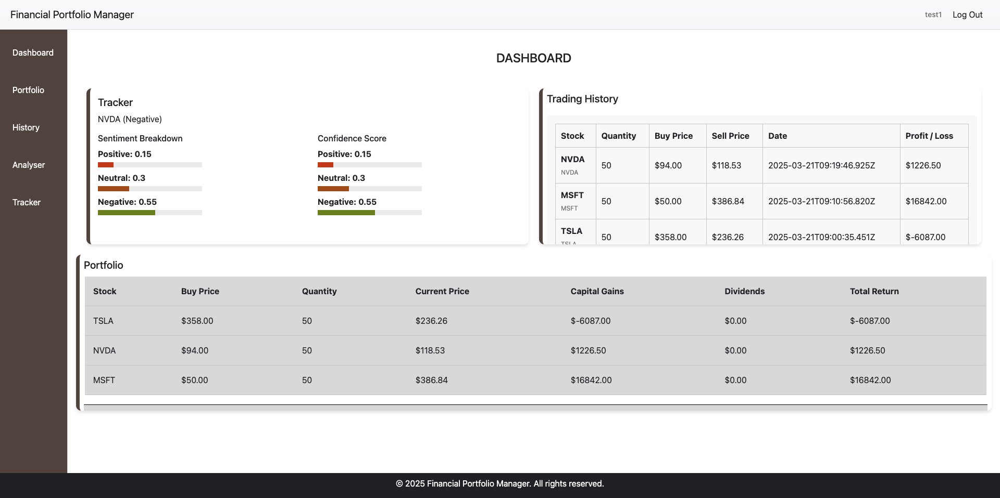

# Financial Portfolio Manager

## Table of Contents
* [Overview](#overview)
* [Technologies Used](#technologies-used)
* [Approach](#approach)
* [Installation & Setup](#installation--setup)
* [User Stories](#users-stories)
* [Video Demo](#video-demo)
* [Unsolved Problems / Major Hurdles](#unsolved-problems--major-hurdles)

## Overview
A financial portfolio manager that allows users to add, edit and track their stock investments. Users can fetch live prices, see profit/loss, and track dividends over time.
The user also has access to a sentiment analysis tool that gives an overall analysis of the market sentiment of a stock as well as the stock's confidence level. This analysis is based on the live financial articles. It also includes a little section that explains the key reasons for this.

## Technologies Used
* **Front End:** React, Webpack, Javascript(ES6+), SCSS
* **Back End:** Ruby on Rails (6.1+), PostgreSQL (in production)
* **Hosting:** Heroku
* **APIs:**
  * Aplhpa Vantage for live stock data
  * Sentiment Analysis API (created in python using FastAPI)

## Approach
1. **Planning & Wireframing:**
  - Sketched out user flows and key interfaces.
2. **Data Modeling:** 
  - Defined how Positions, Trades, and Dividends would relate in the database.
3. **API Integration:** 
  - Integrated Alpha Vantage to fetch live stock prices and symbol suggestions as well as my own Sentiment Tool API.
4. **Front-End Layout & Responsiveness:**
  - Built React components with conditional rendering for mobile vs. desktop.
5. **Testing & Iteration:** 
  - Used local environment and deployed frequently to Heroku for QA.

## Installation & Setup
1. **Clone the Repository:**
git clone https://github.com/Thomasbka/financial-portfolio-manager.git
cd financial-portfolio-manager

2. **Install Ruby Gems & Node Packages**
bundle install
yarn install
(or npm install if you’re using npm)

3. **Set Up the Databse:**
rails db:create
rails db:migrate
rails db:seed  (if you have seed data)

4. **Environment Variables:**
* Create an .env file (or set environment variables) for things like APLHA_VANTAGE_API_KEY.
* Example: ALPHA_VANTAGE_API_KEY=your_api_key_here

5. **Run the server:**
rails server
Then open http://localhost:3000 in your browser.

## Users Stories
* **Who:** Private investors and traders who want to monitor and manage their stock portfolios.
* **What:** They want a simple and responsive interface to add, edit, and track investments with real-time price updates.
* **Why:** To have a centralized tool that displays performance, calculates profits/losses, and provides actionable data to make informed decisions.

## Video Demo

<iframe src="https://player.vimeo.com/video/1068050485?badge=0&amp;autopause=0&amp;player_id=0&amp;app_id=58479" frameborder="0" allow="autoplay; fullscreen; picture-in-picture; clipboard-write; encrypted-media" style="position:absolute;top:0;left:0;width:100%;height:100%;" title="Financial Portfolio Manager Tutorial"></iframe>

# Unsolved Problems / Major Hurdles
* **API Rate Limiting:** Handling AlphaVantage's free-tier rate limits while fetching live data.
* **Responsive Design:** Optimizing the user interface for various screen sizes, particularly for forms and tables.
